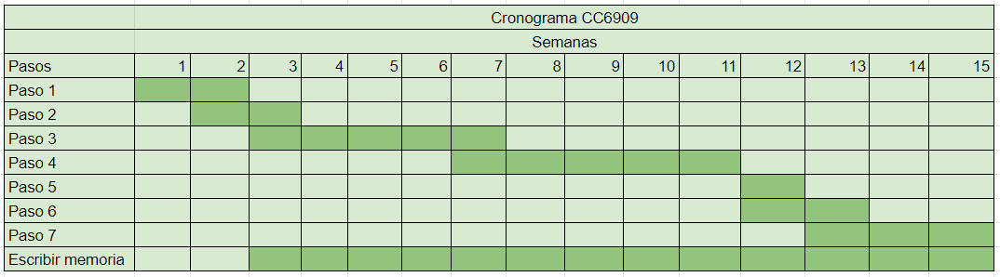

***
# CC6909 - Trabajo de Título
## Ayatori: implementación eficiente de Connection Scan en GTFS con caso de estudio de movilidad en Santiago.
***

En el presente repositorio, iré almacenando todos los archivos (iteraciones de informes, imágenes, datasets, código, etc.) que se utilicen en la realización del Trabajo de Título. La distribución de los directorios es:

### Coding: almacena todo el código utilizado en el proyecto.

### Dataset: todo archivo que sirva para alimentar al algoritmo a desarrollar.

### Documentos CC6908: primeras iteraciones del informe final, incluyendo la Propuesta de Tema de Memoria.

### Imágenes: fotos y diagramas a utilizar en el informe.

### Templates: plantillas para el informe final.

Para desarrollar el proyecto de título durante el semestre de Otoño 2023, se seguirá la siguiente planificación:

donde:

1. Obtener la información de transportes en Santiago, proveniente de GTFS, de encuestas y estudios como la Encuesta Origen Destino, de las trazas de telefonía móvil, y de OpenStreetMap.
2. Estudiar implementaciones de Connection Scan Algorithm (CSA) en Python.
3. Desarrollar una estructura de datos que permita la operación de un algoritmo basado en Connection Scan.
4. Implementar el algoritmo propuesto como solución.
5. Estudiar el pipeline de análisis de datos y los resultados alcanzables en su estado actual.
6. Integrar el algoritmo al pipeline y verificar diferencias en los resultados alcanzables.
7. Utilizar los resultados para inferir situaciones que permitan caracterizar la movilidad urbana en Santiago.

## Plazos

* Inicio Semestre Otoño 2023: TBA.

* Entrega Final: Semana 15 (fechas exactas TBA).