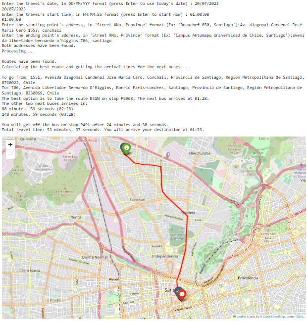

***
## Ayatori: Creación de módulo base para programar algoritmos de planificación de rutas en Python usando GTFS.

Este repositorio contiene el código de Ayatori, un proyecto de implementación de un módulo de programación para crear
herramientas de movilidad urbana, en Python. Este proyecto fue desarrollado como el Trabajo de Título de su autor, Felipe Leal (Lysorek), para optar al título de Ingeniero Civil en Computación en la Universidad de Chile.

El módulo funciona cruzando la información cartográfica de la ciudad, proveniente del proyecto OpenStreetMap, con la
información de cronogramas del transporte público disponible, en formato GTFS. A través de él, se pueden desarrollar
diferentes visualizaciones de la información del transporte, como caracterizar qué tan densas son las paradas en relación
a la cantidad de servicios que se detienen en cada una, como se aprecia en la siguiente figura.

Para ejemplificar su uso, también se incluye una versión simplificada de [Connection Scan Algorithm (CSA)](arxiv.org/abs/1703.05997), algoritmo desarrollado para responder a consultas para sistemas de cronogramas de viajes, siendo capaz de optimizar el viaje entre dos puntos de una ciudad determinada, calculando la mejor ruta con la información del transporte público disponible. Un ejemplo de salida del algoritmo se aprecia en la siguiente figura.

Este repositorio incluye un archivo Jupyter Notebook llamado "algorithm_tester.ipynb" que puede usarse para testear la implementación y analizar la arquitectura del algoritmo.

## Requirements

Esta implementación utiliza la librería [graph-tool](https://graph-tool.skewed.de) para almacenar los datos en grafos. Dado que esta librería no está disponible en Windows, se recomienda instalar el [Windows Subsystem for Linux](https://docs.microsoft.com/es-es/windows/wsl/install-win10). La implementación fue programada usando el sistema operativo [Ubuntu 20.04](https://ubuntu.com/blog/tag/20-04-lts). Además de esto, otras librerías utilizadas son folium y Nominatim.
